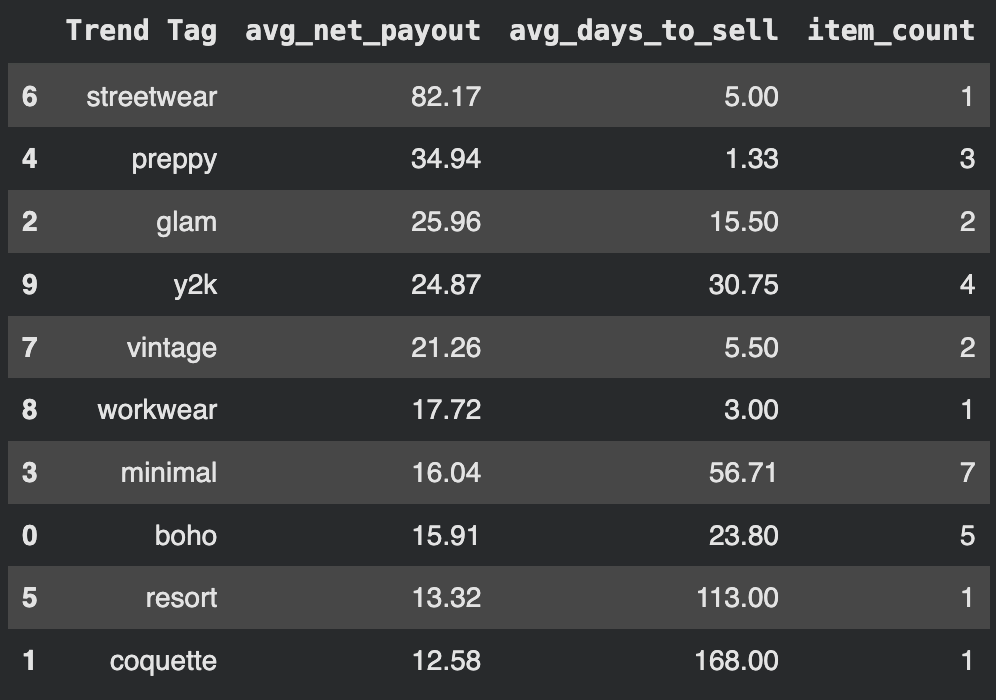

**Trend to evaluate:**

Sheer or near-transparent tops for layering. White/off-white tones with a romantic vibe.

**Reseller constraints:**

Budget: $100

- Time available this week: low

- Sourcing method: in-person thrifting

- Assume a solo reseller with limited storage and no returns accepted.

 Historical performance by trend (from Python analysis):

**Your task:**

- Recommend a small test-buy plan (what to look for + quantity range)

- Flag higher-risk categories or items to avoid

- Assign an overall risk level (low / medium / high) with reasoning

- Suggest what metrics to watch over the next week

- Define what would make this test a “stop” vs “continue” after 7–10 days

- Keep recommendations conservative and practical for a small reseller, based on what is realistically found at typical thrift stores.
